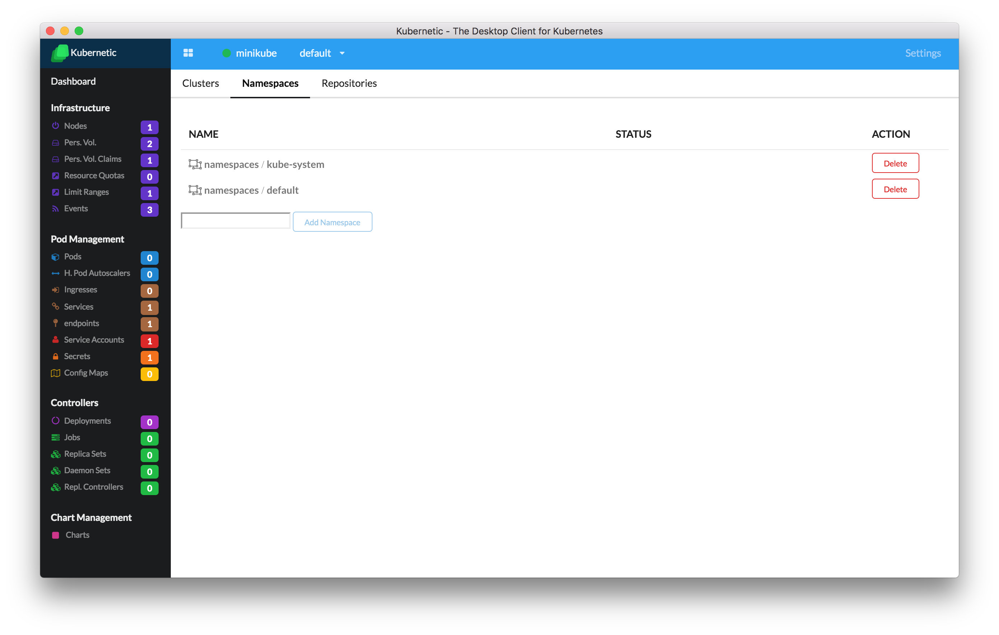

# 3.0. Namespaces

Now that you have a working cluster connected to your _Kubernetic_ client you can continue with handling the namespaces.

**Note:** make sure your cluster where you run the tutorial **is not your production environment**. Although we take precautions to avoid mingling with existing cluster load, there are no guaranties of no interference.

Namespaces is a way to virtually split an existing cluster to separate environments. Most objects inside Kubernetes act inside a specific namespace, which means when you switch namespace a fresh environment will be provided.

Go to the **Settings** &gt; **Namespaces** screen.

You will see there your existing namespaces. Kubernetes creates an active _"default"_ namespace automatically which is where your objects act on by default. It also creates a _"kube-system"_ namespace where all cluster's management objects are stored \(e.g. A DNS service\).

Let's create a namespace:

* Fill name: **kubernetic-tutorial**
* Click **Add Namespace** button

You will automatically be directed to the newly created namespace. You can see your active namespace a the top menu bar.

Also, your _kubectl_ configuration has been updated and the current context now points to the new namespace. So if you use _kubectl_ now it will be in sync with the cluster and namespace you view in _Kubernetic_. If you switch using _kubectl_ the context, _Kubernetic_ will pick up the change and show you the selected context.

