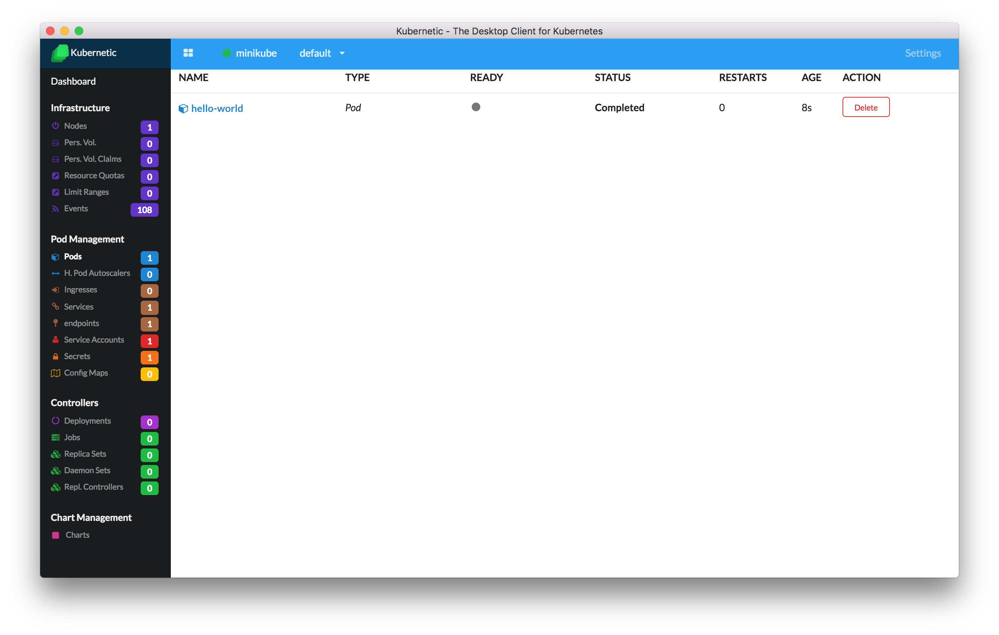
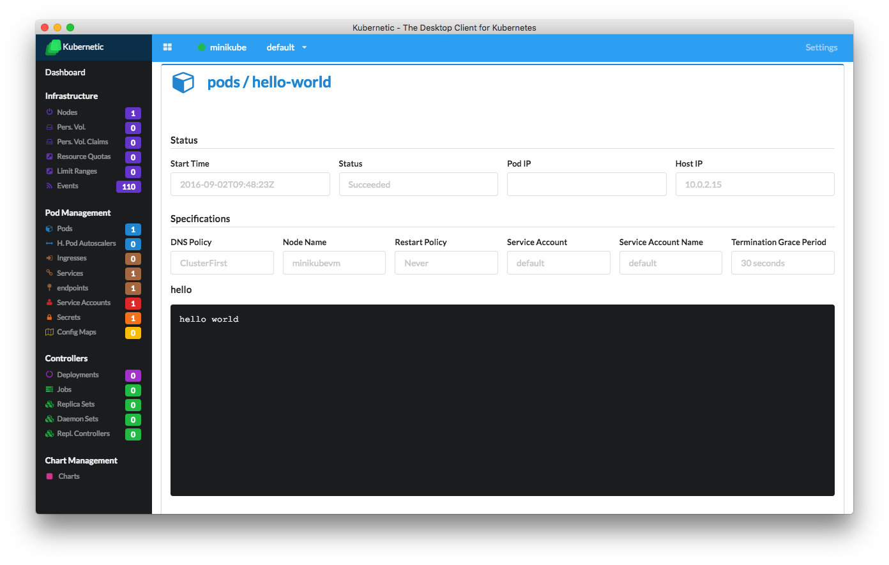
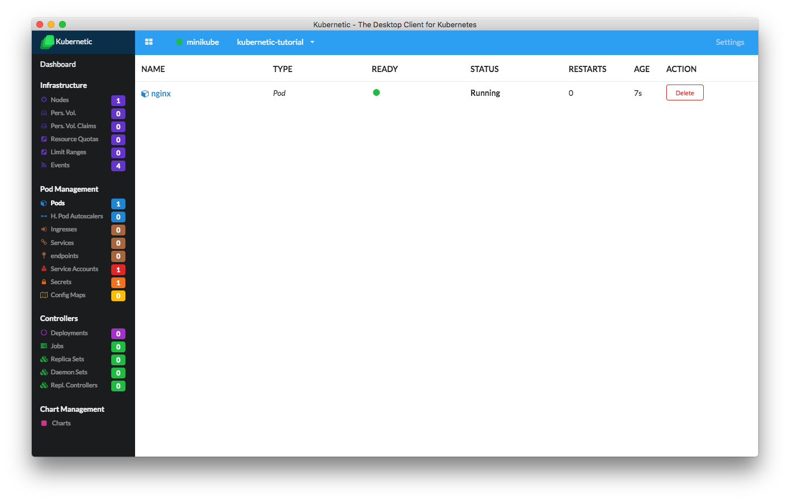

# Pods


[Pods](https://kubernetes.io/docs/concepts/workloads/pods/pod/) are the smallest deployable units of computing that can be created and managed in Kubernetes.


To explain pods we need first to address containers.

Container is a process \(or set of processes\) that runs in a jailed environment so that it doesn't interfere with other processes. This means from the point of view of the application \(process\) it has its own IP, disk, cpu and memory.

A Pod is an instance of one or more containers under the same IP. In most cases a Pod contains just one container, in some edge cases a pod contains multiple containers and they are bound under the same IP to create a tight integration.

In this Tutorial you'll learn how to run different types of Pods.

#### Requirements

* Add **kubernetic** Repository as described [here](https://docs.kubernetic.com/settings/repositories#adding-repository) before continuing

## Short Lived Single-Container Pod

Let's start simple and create a pod with one container. We will run an clean Alpine OS and output a "Hello World" message, the container will finish immediately and will not be restarted automatically.

> [Alpine Linux](https://alpinelinux.org/) is a security-oriented, lightweight Linux distribution based on musl libc and busybox.


Before continuing make sure your active namespace is **kubernetic-tutorial**


Go to the tutorial chart repo and run the `pod-hello-world` chart.

Here is the Pod definition:

```text
apiVersion: v1
kind: Pod
metadata:
  name: hello-world
spec:
  restartPolicy: Never
  containers:
  - name: hello
    image: "alpine:3.4"
    command: ["echo", "hello world"]
```

Now go to the Pods section. You'll see the `hello-world` pod.

Initially the status will be in `ContainerCreating` while it downloads the docker image of alpine. Then it will change to `Running` while the container is in running state. It will then immediately change to `Completed` meaning that the container finished and returned a non-zero status.



Click on the pod. You will see the output of the pod is "Hello World".



In this example the Pod didn't restart itself after container's completion, because we set the `restartPolicy: Never`.

You can now delete the Pod.

## Long Running Single-Container Pod

A more useful example is a long running container. We'll now create a pod with one container that will run nginx.

> **NOTE:** Make sure you are pointing to the **"kubernetic-tutorial"** namespace.

Go to the tutorial chart repo and run the `pod-nginx` chart.

Here is the Pod definition:

```text
apiVersion: v1
kind: Pod
metadata:
  name: nginx
spec:
  containers:
  - name: nginx
    image: nginx:1.11
    ports:
    - containerPort: 80
```

Now go to the Pods section. You'll see the `nginx` pod.



You'll see that the Pod once it finishes to download the image it is in `Running` State and is staying running.

If you click on the Pod you'll not see any logs, but that's ok because Nginx doesn't give any logs. We'll see later how we can use the Nginx, but for now let's delete the Pod.

## Multi-Container Pod

As we described before a Pod can have one or more containers, in this scenario we'll show how to run a Pod with two containers. As a general rule of thumb having multi-container Pods should be avoided when possible.

Containers inside the same Pod are co-located \(they cannot be spread to different machines\), the scale up or down together \(they cannot be scaled separately if needed\) and share the same network IP \(There may exist port conflicts if not designed propoerly\). This makes the containers that are under the same port to be tightly-coupled, instead of loosely-coupled.

But there are some scenarios where this tightly-coupled containers are necessary, such as side-kick, health-check or log-collecting processes.

In our example we'll use a nginx together with an alpine container that will do requests of the nginx every 2 secs.

> **NOTE:** Make sure you are pointing to the **"kubernetic-tutorial"** namespace.

Go to the tutorial chart repo and run the `pod-multi-container` chart.

Here is the Pod definition:

```text
apiVersion: v1
kind: Pod
metadata:
  name: multi-container
spec:
  terminationGracePeriodSeconds: 0
  containers:
  - name: nginx
    image: nginx:1.11
    ports:
    - containerPort: 80
  - name: alpine
    image: alpine:3.4
    command: ["watch", "wget", "-qO-", "localhost"]
```

You should be able to see now the `multi-container` pod in Pods view.


If you enter inside the Pod you'll see that logs of the two containers. While alpine container runs get requests to the nginx, on the nginx container you'll see the request registered in the logs.

In the Pod definition you can see that the alpine container does wget requests on `localhost`. This is because the containers inside the same Pod share the same IP.


## Cleanup

Go to the Releases section


Delete the releases of the following Charts:

* `pod-hello-world-0.1.0`
* `pod-nginx-0.1.0`
* `pod-multi-container-0.1.0`

This will trigger the deletion of all the items generated by the Charts.

